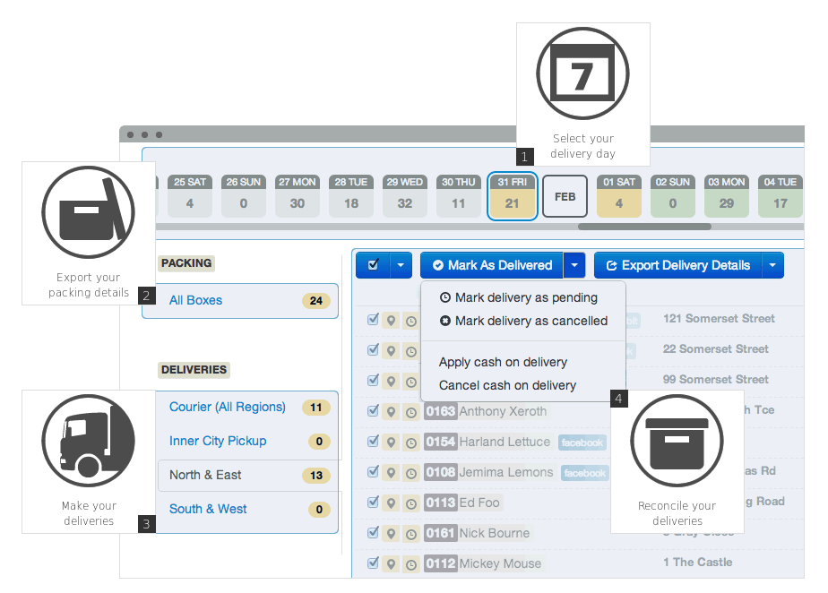

# Bucky Box Core

[](https://gitlab.com/buckybox/core/commits/master)
[](https://gitlab.com/buckybox/core/commits/master)
[](https://codeclimate.com/github/buckybox/core)

Bucky Box Core is part of the [Bucky Box](http://www.buckybox.com/) platform.
It allows food producers and distributors to manage customers and get orders, payments and delivery lists.



## Configuration

See [config/application.yml](config/application.yml.example):

- required variable: `SECRET_TOKEN`
- to send emails (recommended): `SPARKPOST_USERNAME` and `SPARKPOST_PASSWORD`
- to interface with the web store (optional): `API_MASTER_KEY` and `API_MASTER_SECRET`
- other variables can be left to default values.

## Ruby version and system dependencies

See [CI config](.gitlab-ci.yml).

## Services

- Postgresql 9.5+ (main DB)
- Redis (cache store)

## Installation and deployment

See [INSTALL.md](INSTALL.md).

## Contributing

Any bug fix or tweak is welcomed but if you have bigger plans, please drop us a line at `support AT buckybox.com` first.

## Translation

You can help translate it into your favorite language.
We use [Transifex](https://www.transifex.com/projects/p/buckybox-core/).
New translations can be fetched with `tx pull -af`.

## Tests

```bash
./script/ci
# or
git commit && gitlab-ci-multi-runner exec docker integration
```

## License

See [LICENSE](LICENSE).
